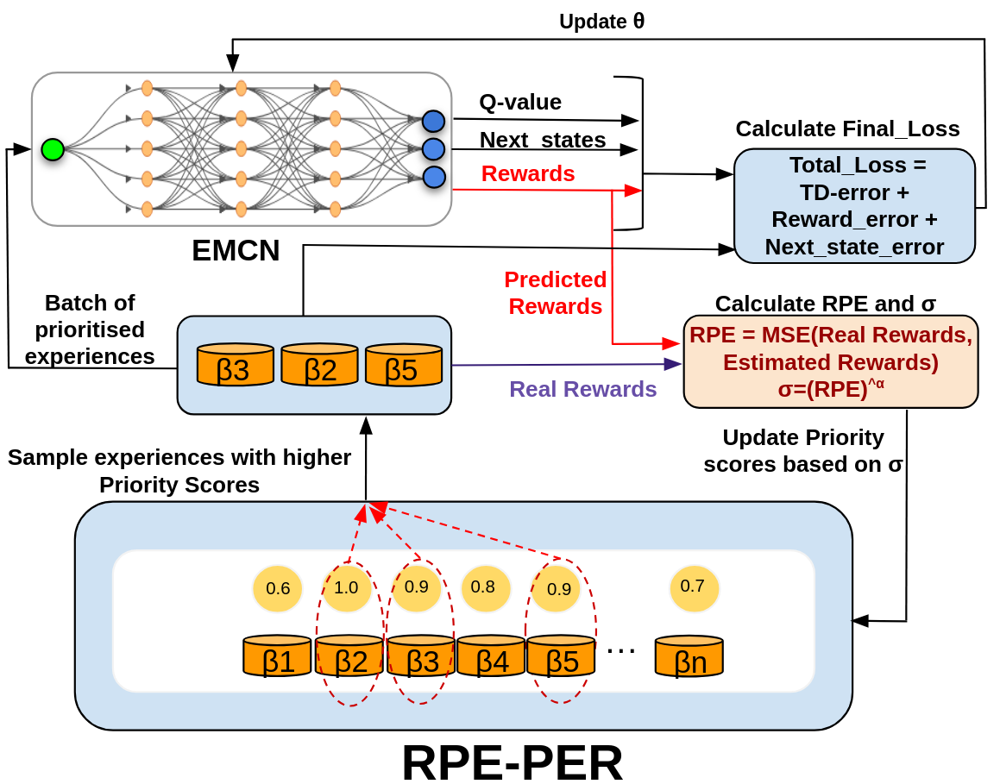

# Reward-Driven Prioritised Experience Replay 
The following repository contains the PyTorch implementation of *Reward Prediction Error Prioritisation Experience Replay* (RPE-PER). It is integrated into two off-policy  RL algorithms: TD3 and SAC. 

The algorithm is tested on [MuJoCo](https://www.gymlibrary.dev/environments/mujoco/index.html) continuous control suite. 

## Network Architecture 


## Instructions 
### Prerequisite Versions
|Library  |Version|
|---------|-------|
|pydantic |1.10.10|
|MuJoCo|2.3.3|

### Training
To train the RD-PER TD3 or SAC, use the following command: 

```py
python3 training_loop_SAC.py
# or
python3 training_loop_TD3.py
``` 

## Citation
Please cite the paper and the github repository if used. 
