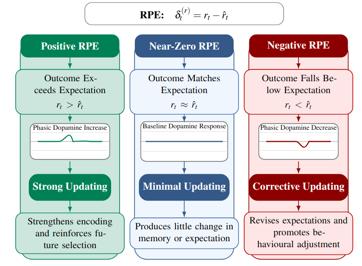
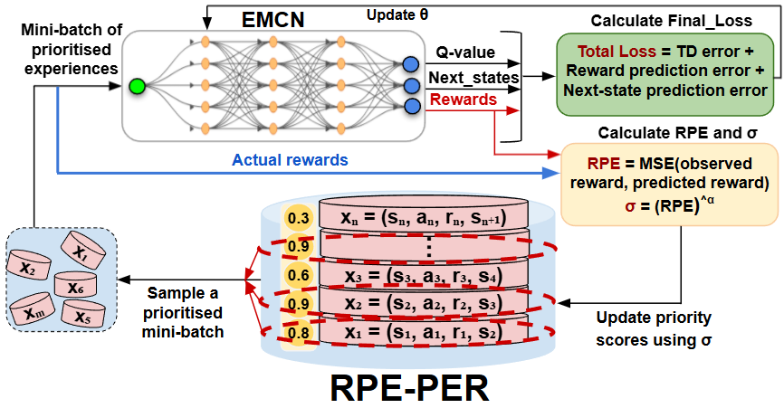

# Reward Prediction Error Prioritised Experience Replay (RPE-PER)

> ### 🧠 We learn more when reality differs from what we expected.
>
> **RPE-PER brings this biological learning principle into experience replay.**

When an outcome is exactly what we expected, there is often little reason to substantially revise our expectations. But when reality turns out to be **much better or much worse than expected**, the mismatch creates a stronger learning signal.

Think about visiting a familiar restaurant.

If the meal is exactly as good as expected, your opinion of the restaurant may barely change. But if it is unexpectedly excellent — or surprisingly terrible — that experience is much more likely to influence what you remember and what you choose next time.

This difference between **expected reward** and **received reward** is known as **Reward Prediction Error (RPE)**.

<p align="center">
  
</p>

In its signed biological form,

[
\delta_t^{(r)} = r_t - \hat{r}_t
]

where (r_t) is the reward actually received and (\hat r_t) is the expected reward.

* **Positive RPE:** reality is better than expected → strong updating
* **Near-zero RPE:** reality matches expectation → little updating
* **Negative RPE:** reality is worse than expected → corrective updating

The central intuition is simple:

> **The greater the violation of expectation, the more informative the experience can be for learning.**

RPE-PER asks whether reinforcement-learning agents can use the same principle when deciding **which past experiences deserve to be replayed more often**.

---

## 💡 From Reward Surprise to Experience Replay

Reinforcement-learning agents can collect thousands or millions of transitions:

[
(s_t,a_t,r_t,s_{t+1})
]

and store them in a replay buffer.

But not every stored experience is equally informative.

Standard **Experience Replay** samples transitions uniformly. **Prioritised Experience Replay (PER)** improves on this by sampling transitions with large temporal-difference (TD) errors more frequently.

However, TD error depends on value estimates:

> **How wrong was my estimate of long-term value?**

RPE-PER instead asks a more direct question:

> ### **How wrong was my expectation of the reward I actually received?**

This provides a simple and interpretable signal for identifying experiences whose outcomes are still poorly predicted.

---

# 🔄 RPE-PER

**Reward Prediction Error Prioritised Experience Replay (RPE-PER)** is an experience-selection strategy that prioritises transitions according to the discrepancy between their **predicted** and **observed** rewards.

For each stored transition,

[
x_i=(s_i,a_i,r_i,s'_i),
]

the agent predicts its immediate reward:

[
\hat r_i = R_\theta(s_i,a_i).
]

RPE-PER then computes

[
\mathrm{RPE}*i =
\left(R*\theta(s_i,a_i)-r_i\right)^2.
]

The squared formulation measures the **magnitude of reward surprise**.

Therefore, both:

* an outcome that is **much better than expected**, and
* an outcome that is **much worse than expected**

can receive high priority.

An experience whose reward closely matches the prediction receives a smaller RPE and therefore generally needs less replay.

In short:

```text
Expected reward ≈ Actual reward
            ↓
     Small prediction error
            ↓
      Lower replay priority


Expected reward ≠ Actual reward
            ↓
     Large prediction error
            ↓
      Higher replay priority
            ↓
       Learn from it again
```

---

## 🎯 Prioritising Unexpected Experiences

The priority of transition (i) is defined as

[
\sigma_i = \mathrm{RPE}_i + \epsilon,
]

where (\epsilon>0) ensures that every transition remains sampleable.

Its probability of being selected from the replay buffer is then

[
p_i =
\frac{\sigma_i^\alpha}
{\sum_j \sigma_j^\alpha},
]

where (\alpha) controls the strength of prioritisation.

Transitions containing greater reward-prediction discrepancies are therefore replayed more frequently.

Importance-sampling weights are used during optimisation to compensate for the bias introduced by non-uniform sampling.

---

# 🧠 Enhanced Model Critic Network

To make reward-based prioritisation possible, RPE-PER introduces an **Enhanced Model Critic Network (EMCN)**.

A conventional critic primarily estimates the value of a state–action pair. EMCN extends this representation by jointly predicting:

[
C_\theta(s,a)=
\left(
Q_\theta(s,a),
R_\theta(s,a),
T_\theta(s,a)
\right),
]

where:

* (Q_\theta(s,a)) — action-value estimate
* (R_\theta(s,a)) — immediate reward prediction
* (T_\theta(s,a)) — next-state prediction

The reward-prediction head provides the expected reward required to calculate RPE.

Importantly, **predicted rewards do not replace observed rewards in value learning**. The original observed environment reward is still used to construct the RL value target.

Reward prediction is used to answer a different question:

> **Which experiences should the agent revisit more often?**

---

## 🏗️ RPE-PER Architecture

<p align="center">
  
</p>

The overall process is:

```text
                 Environment
                      │
                      ▼
              Observe transition
             (s, a, r, s')
                      │
                      ▼
                Replay Buffer
                      │
                      ▼
          Enhanced Model Critic
                │          │
                │          └──► Predict reward r̂
                │
                ▼
          Value estimation
                           Actual reward r
                                 │
                Predicted r̂ ────┤
                                 ▼
                         Reward Prediction
                              Error
                                 │
                                 ▼
                         Replay Priority
                                 │
                                 ▼
                      Prioritised Sampling
                                 │
                                 ▼
                       Actor/Critic Update
```

---

# ✨ Why RPE?

Traditional PER relies on **TD error**, which mixes information from immediate rewards, bootstrapped future-value estimates, target networks, and function approximation.

Large TD error does not necessarily mean that the observed outcome itself was surprising.

RPE isolates a simpler signal:

[
\textbf{What did I expect to receive?}
\qquad\text{vs.}\qquad
\textbf{What did I actually receive?}
]

This gives RPE-PER several useful properties:

* **Reward-grounded** — priority is directly related to observed task reward.
* **Interpretable** — high RPE means that reality differed substantially from expectation.
* **Independent of TD error for prioritisation** — replay priority does not rely solely on bootstrapped value discrepancies.
* **Biologically motivated** — inspired by reward-prediction mechanisms associated with learning and memory.
* **Simple to integrate** — the underlying off-policy RL objective remains unchanged.
* **Algorithm-independent in principle** — demonstrated here with both TD3 and SAC.

---

# 🚀 Supported Algorithms

RPE-PER is integrated with two off-policy continuous-control algorithms:

### TD3

**Twin Delayed Deep Deterministic Policy Gradient**

### SAC

**Soft Actor-Critic**

This allows RPE-based replay to be evaluated under both deterministic and stochastic policy-learning settings.

---

# 🧪 Experiments

RPE-PER is evaluated on continuous-control environments from the [MuJoCo](https://www.gymlibrary.dev/environments/mujoco/index.html) benchmark suite:

* `Ant-v4`
* `HalfCheetah-v4`
* `Hopper-v4`
* `Humanoid-v4`
* `Swimmer-v4`
* `Walker2d-v4`

The method is compared against:

* **Uniform Replay**
* **PER** — Prioritised Experience Replay
* **LAP** — Loss-Adjusted Prioritisation
* **LA3P** — Loss-Adjusted Approximate Actor Prioritised Experience Replay
* **MaPER** — Model-Augmented Prioritised Experience Replay

The experiments investigate whether **reward-prediction discrepancy provides a more useful replay signal than conventional value-based prioritisation**.

Across the evaluated environments, RPE-PER demonstrates strong performance with both TD3 and SAC, with particularly consistent gains in the TD3 experiments.

---

# ⚙️ Installation

## Prerequisites

| Library    |   Version |
| ---------- | --------: |
| `pydantic` | `1.10.10` |
| `MuJoCo`   |   `2.3.3` |

Clone the repository and install the required dependencies before training.

---

# 🏃 Training

### TD3 + RPE-PER

```bash
python3 training_loop_TD3.py
```

### SAC + RPE-PER

```bash
python3 training_loop_SAC.py
```

---

# 🔬 The Core Idea in One Sentence

> ### **Replay the experiences that violate the agent's reward expectations.**

Rather than treating every memory equally, RPE-PER focuses learning on experiences whose outcomes are still surprising to the agent.

---

# 📄 Paper

This repository accompanies our work:

**Reward Prediction Error Prioritisation in Experience Replay: The RPE-PER Method**  
Hoda Yamani, Yuning Xing, Lee Violet C. Ong, Bruce A. MacDonald, and Henry Williams

Presented at the **Australasian Conference on Robotics and Automation (ACRA 2024)**.

📄 **Paper:** [arXiv:2501.18093](https://arxiv.org/abs/2501.18093)

The paper investigates **Reward Prediction Error (RPE)** as a biologically motivated signal for prioritising informative experiences in continuous-control reinforcement learning.

---

# 📚 Citation

If you use **RPE-PER** or this repository in your research, please cite:

```bibtex
@article{yamani2025reward,
  title={Reward prediction error prioritisation in experience replay: The RPE-PER method},
  author={Yamani, Hoda and Xing, Yuning and Ong, Lee Violet C and MacDonald, Bruce A and Williams, Henry},
  journal={arXiv preprint arXiv:2501.18093},
  year={2025}
}
